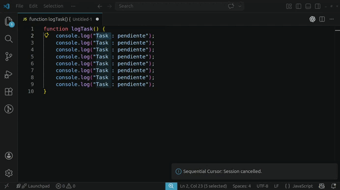

# Sequential Cursor

Edit each multi-cursor position **one by one**, without jumping around manually.



---

## How it works

1. Set up multiple cursors/selections normally in VS Code (`Alt+Click`, `Ctrl+D`, etc.)
2. Press **Ctrl+Alt+S** (Mac: **Cmd+Alt+S**) to enter Sequential Edit mode
3. The first selection is focused — edit it however you want
4. Press **Tab** to move to the next position
5. Use **Alt+↑ / Alt+↓** to jump freely between cursors
6. Press **Escape** to cancel and restore all original selections

## Keyboard shortcuts

| Key | Action |
|-----|--------|
| `Ctrl+Alt+S` / `Cmd+Alt+S` | Start sequential edit mode |icon
| `Tab` | Confirm and go to next |
| `Shift+Tab` | Skip current and go to next |
| `Alt+↓` | Navigate to next cursor |
| `Alt+↑` | Navigate to previous cursor |
| `Escape` | Cancel session |

> `Tab`, `Shift+Tab` and `Alt+↑↓` only have their special meaning while sequential mode is active.

## Visual feedback

- The **active** position is highlighted with a colored border
- All **other** positions are dimmed so you know they're waiting
- The **status bar** shows your current progress and available shortcuts

## Settings

| Setting | Default | Description |
|---------|---------|-------------|
| `sequentialCursor.showProgressInStatusBar` | `true` | Show progress in status bar |
| `sequentialCursor.highlightColor` | `#FF6B6B` | Highlight color for the active cursor |

## Example use case

You have variables with similar names and want to rename each one differently:

```js
const firstName = ...
const lastName  = ...
const userName  = ...
```

Select `first`, `last`, `user` with `Ctrl+D`, activate Sequential Cursor, and type each replacement one by one — no clicking around.